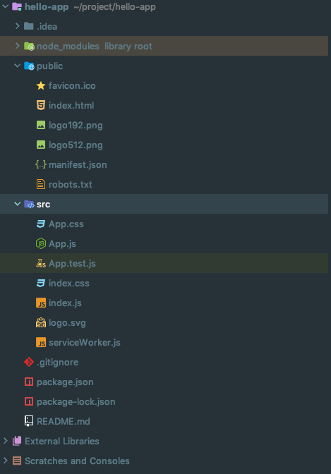
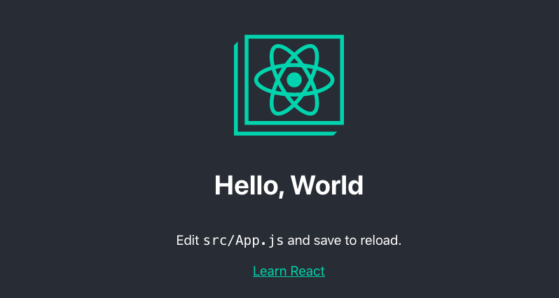

# HelloWorld

### create-react-app이란?

빌드 설정  없이 리액트 개발을 간단하게 할 수 있게 제공하는 개발 도구

Node를 먼저 설치 해야 함.

### create-react-app설치

```text
$ npm install -g create-react-app
```

### 애플리케이션 만들기

```text
$ create-react-app hello-app
```

### 프로젝트 구성



* node\_modues - 애플리케이션 개발에 필요한 node.js 모듈을 저장
* pakage.json - node.js 애플리케이션 설정 파일
* public - 소스코드를 제외한 애플리케이션 관련된 리소스 저장
* src - 애플리 케이션 소스코드

### Hello World 출력!

src/Apps.js에 Hello World 추가



```javascript
import React from 'react';
import logo from './logo.svg';
import './App.css';

function App() {
  return (
    <div className="App">
      <header className="App-header">
        
          <h1 className="App-title">Hello, World</h1> //<-- 추가
        <p>
          Edit <code>src/App.js</code> and save to reload.
        </p>
        <a
          className="App-link"
          href="https://reactjs.org"
          target="_blank"
          rel="noopener noreferrer"
        >
          Learn React
        </a>
      </header>
    </div>
  );
}

export default App;
```



```text
$ npm start
```



