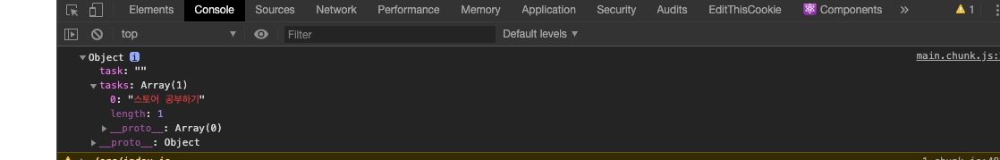

# 리덕스 애플리케이션 상태관리

### 리덕스만으로 Todo 애플리케이션 구현하기

#### 리덕스 설치

```text
$ npm install --save redux
```

### 리덕스 구성하기

* 스토어: 애플리케이션 상태를 가지고있음
* 리듀서: 스토어가 가지고 있는 상태를 변화시키기 위한 함수
* 액션: 입력, 웹, 요청 완료 처럼 어떠한 상태 변화를 이르킬수 있는 현상

#### 리듀서 정의

```javascript
const initialState = {
    task: '',
    tasks: []
}; //초기


function tasksReducer(state = initialState, action) {
    switch (action.type) {
        case 'INPUT_TASK':
            return {
                ...state,
                task: action.payload.task
            };
        case 'ADD_TASK':
            return {
                ...state,
                tasks: state.tasks.concat([action.payload.task])
                //state push를 사용하면 state자체에 변경이 가해져서 예상치 못한 
                //부작용이 발생할 가능성이 있음
                //그래서 concat이나 Object.assing, 스프레드 연산자를 사용하는게 좋
            };
        default:
            return state;
    }
}
```

#### 플럭스 표준 액션

액션의 형식을 표준화한 것임

type속성은 필수적으로 사용해야함.

그  밖의 프로퍼티

* payload : 액션에 따라 데이터로 사용할 수 있음
* error: 오류를 표현하고 싶은 경우 true 설정 true일 경우 payload에도 Error 객체를 넣어야함.
* meta: payload외에 정보를 액션에 포함시키고 싶은 경우 사용

### 액션크리에이터 정의하기

액션크리에이터\(ActionCreator\)는 액션을 생성하기 위한 함


```javascript
const addTask = (task) => ({
    type: 'ADD_TASK',
    payload: {
        task
    }
});
```


태스크로 추가하고 싶은 task를 매개변수로 받고, 액션 객체를 리턴

### 스토어 생성

리덕스는 createStore라는 함수를 가지고 있으며 이를 이용해 스토어 생성

애플리케이션 전체에서 유일한 스토어를 사용해 애플리케이션 전체의 상태를 집약해서 관리

tasksReducer를 이용해 리덕스 스토어를 만

```javascript
import { createStore } from 'redux';

const store = createStore(tasksReducer);

```

#### createStore\(reducer, \[preloadedState\], \[enhancer\]\)

스토어는 애플리케이션 전체 상태 트리를 관리

* 첫 번째 매개변수에는 리듀서를 전달
* 두 번째 매개변수는 스토어의 초기값을 객체로 전달 주로 서버 사이드 또는 사용자 세션을 미리 데이터를 저장하고 있는 경우
* 스토어의 기능을 확장할 수 있게 해주는 서드파티 도구를 옵션 지정

#### 스토어에 4가지 메소드

* dispatch
* subscribe
* getState
* replaceReducer

dispatch 메서드를 사용해 액션을 발행

ADD\_TASK라는 type을 가진 액션이 발행 되어 리듀서에 의해 상태가 변경

```javascript
const addTask = (task) => ({
    type: 'ADD_TASK',
    payload: {
        task
    }
});
store.dispatch(addTask('스토어 공부하기'));
console.log(store.getState());
```



subscribe는 스토어의 상태가 변경될때 호출할 콜백함수를 지정 가능

